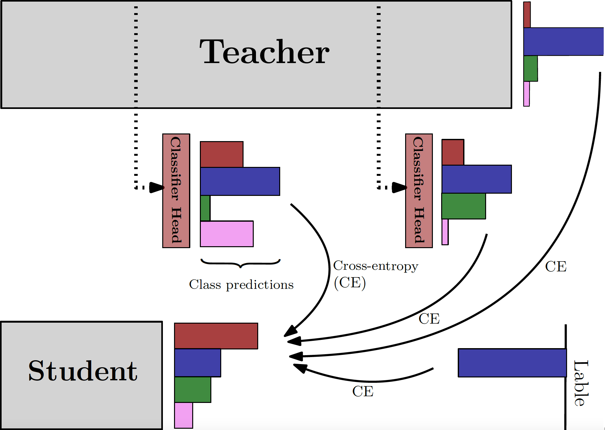

# Distilling Knowledge via Intermediate Classifier Heads (DIH)
<section>

  <b>Distilling Knowledge via Intermediate Classifier Heads (DIH)</b> is a knowledge distillation framework which specifically tries to mitigate the negative impact of <b>capacity gap</b> between the teacher and the student model on knowledge distillation. This approach improves the canonical knowledge distillation (KD) with the help of teacher's <b>intermediate representations</b>.
   
  DIH pipeline:
  <ol>
  <li>First <b>k</b> classifier heads have to be mounted at various intermediate layers of the tecaher.</li>
  <li>The added intermediate classifier heads pass a <b>cheap</b> fine-tuning ( while the main teacher is forzen).</li>
  <li>The cohort of classifiers (all the mounted ones + the final main classifier) co-teach the student simultaneously with knowledge distillation.</li>
  </ol>
Our experiments on various teacher-student pairs of models and datasets have demonstrated that the proposed approach outperforms the canonical knowledge distillation approach and its extensions, which are intended to address the capacity gap problem.
   
    
  </section>
  <section>
  <h2>Requirements</h2>
  <ul>
  <li>torch==1.7.1</li>
  <li>torchvision==0.8.2</li>
  <li>tqdm==4.48.2</li>
  <li>torchsummary</li>
   <li>numpy==1.19.4</li>
    <li>argparse</li>
    <li>os</li>
 </ul>
  <code>pip3 install -r requirements.txt</code>
</section>

<section>
  <h2>Datasets</h2>
   <ul>
  <li><a href="https://www.cs.toronto.edu/~kriz/cifar.html">CIFAR-10</a></li>
  <li><a href="https://www.cs.toronto.edu/~kriz/cifar.html">CIFAR-100</a></li>
 </ul>
 </section>
 
 <section>
  <h2>Instructions</h2>
  <li>First the a selected teacher model should be trained with regular cross-entropy with the hyper-parameters mentioned above.</li>
  <li>For each selected teacher, a number of mounted <b>intermediate classifier heads</b> need to be fine-tuned. The number of added intermediate heads for each model are available in the following table.
  <table style="width:400px">
  <tr>
  <th>Teacher Model</th>
  <th># Intermediate heads (k)</th> 
   </tr>
    <tr>
    <td>ResNet-34</td>
    <td>4</td>
    </tr>
     <tr>
    <td>ResNet-18</td>
    <td>4</td>
    </tr>
     <tr>
    <td>VGG-11</td>
    <td>4</td>
    </tr>
     <tr>
    <td>ResNet-110</td>
    <td>3</td>
    </tr>
     <tr>
    <td>ResNet-20</td>
    <td>3</td>
    </tr>
     <tr>
    <td>ResNet-14</td>
    <td>3</td>
    </tr>
     <tr>
    <td>ResNet-8</td>
    <td>4</td>
    </tr>
</table>
 
  
  
  </li>
  <li>For training a model with <b>regular cross-entropy</b> the following template should be run:
     
     <code>python3 test.py --model  --batch_size  --dataset  --epochs --gpu_id  --lr --schedule --wd </code>
  </li>
  <li>For training the selected student model with <b>DIH</b> the following template should be run:
     
     <code>python3 test.py --alpha  --batch_size  --dataset  --epochs --gpu_id  --lr --schedule --temperature  --wd --training_type ce --path_to_save</code>
  </li>
  
  
  <section>
   <h3> Hyper-parameters to set</h3>
   
  
  <table style="width:400px">
  <tr>
  <th>Hyper-parameter</th>
  <th>args tag</th> 
  <th>Default value</th> 
   </tr>
    <tr>
    <td>student model</td>
    <td>student</td>
    <td>res8</td>
    </tr>
     <tr>
    <td>teacher model</td>
    <td>teacher</td>
    <td>res110</td>
    </tr>
    <tr>
    <td>learning rate</td>
    <td>lr</td>
    <td>0.1</td>
    </tr>
     <tr>
    <td>weight decay</td>
    <td>wd</td>
    <td>5e-4</td>
    </tr>
     <tr>
    <td>epochs</td>
    <td>epochs</td>
    <td>200</td>
    </tr>
     <tr>
    <td>dataset</td>
    <td>dataset</td>
    <td>cifar10</td>
    </tr>
     <tr>
    <td>schedule</td>
    <td>schedule</td>
    <td>[60,120,180]</td>
    </tr>
     <tr>
    <td>temperature τ (KD)</td>
    <td>kd_temperature</td>
    <td>5</td>
    </tr>
     <tr>
    <td>α (KD)</td>
    <td>kd_alpha</td>
    <td>0.1</td>
    </tr>
      <tr>
    <td>batch size</td>
    <td>batch_size</td>
    <td>64</td>
    </tr>
     <tr>
    <td>training type</td>
    <td>training_type</td>
    <td>dih</td>
    </tr>
</table>
 
  
  
  </section>
  
  
  
</section>

  
  <section>
  <h2>Example</h2>
  
Student=ResNet8, Teacher=ResNet110, CIFAR-100  

  <code>python3 test.py --alpha 0.1  --batch_size 64  --dataset cifar100  --epochs 200 --gpu_id 0  --lr 0.1 --schedule [60, 120, 180] --temperature 5 --wd 0 .0005
</code>
 
  
</section>

<section>
  
  <h2>Cite</h2>
  
TBA

  </section>
